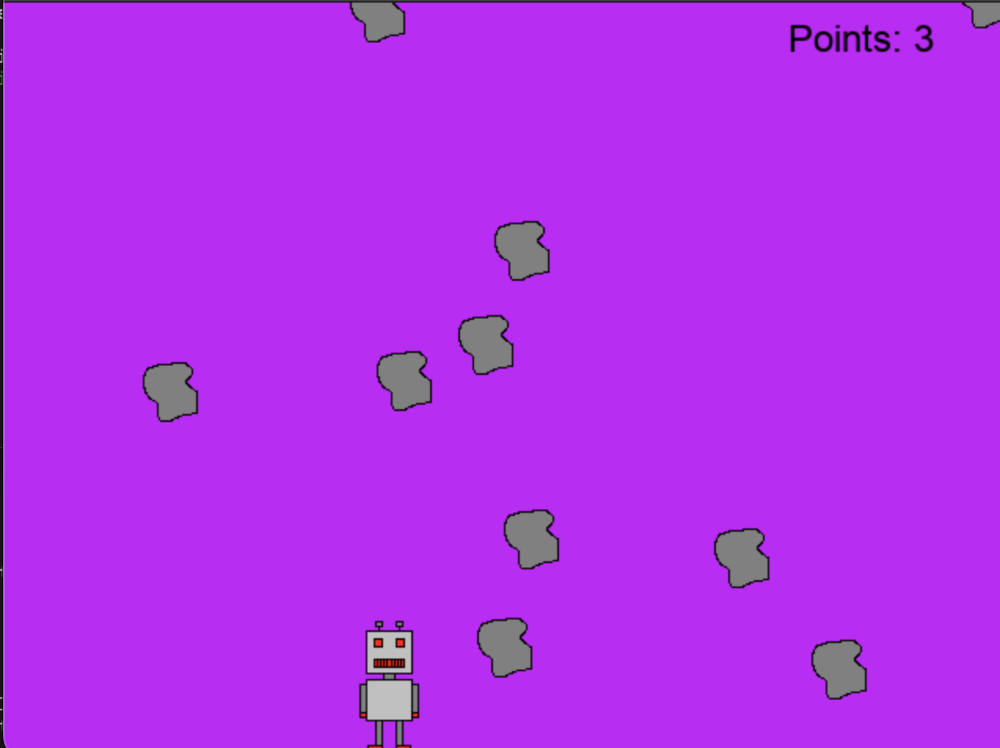

# Robot vs. rocks

### The aim of the game is to collect as many rocks as you can. If any of the rocks hit the bottom of the screen, the game ends. You can see your points at the top of the screen. 

## Getting started:
- In your terminal, navigate to the src folder of the project.
- The game is then started with running `python3 main.py` in the terminal. 

